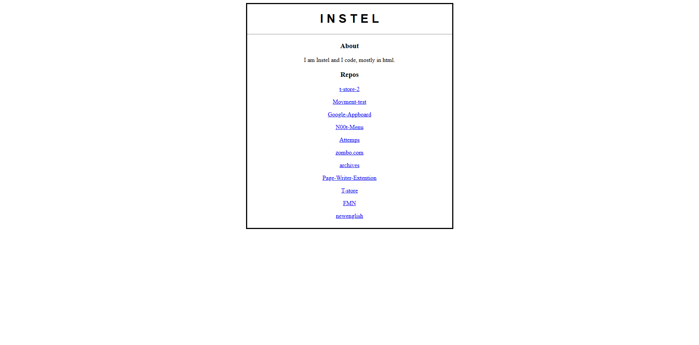
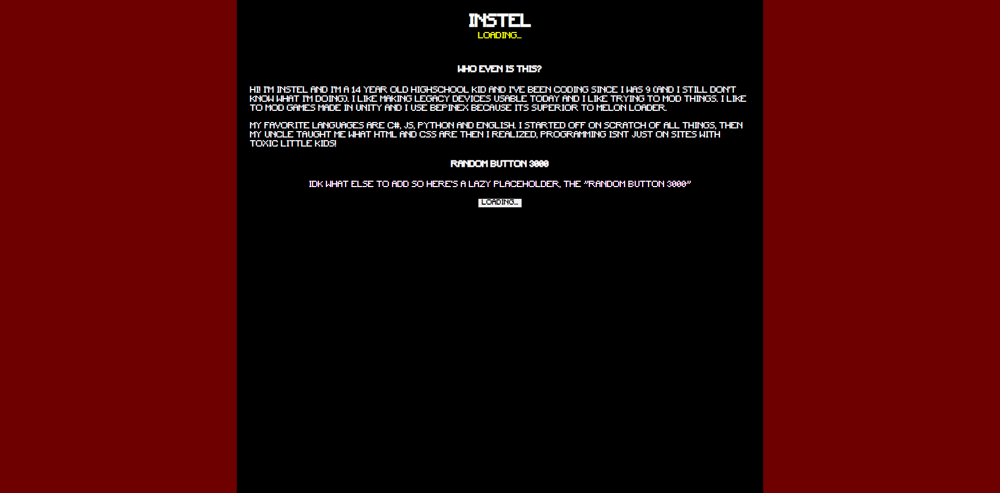

# Instel12.github.io
👆 get a load of that header
<hr>

This is my static website i guess. Its safe to say it got a huge improvement. The original source was just 1 html file with very minimal css.
<br>
Since your here at the readme unlike probably most people, you can break the website by running this:
```js
MakeTheSiteTweakOutPleaseWorking2026NoVirusLegit();
```
<hr>
Here's a before and after
<div style="display: flex;">
    
    
</div>
